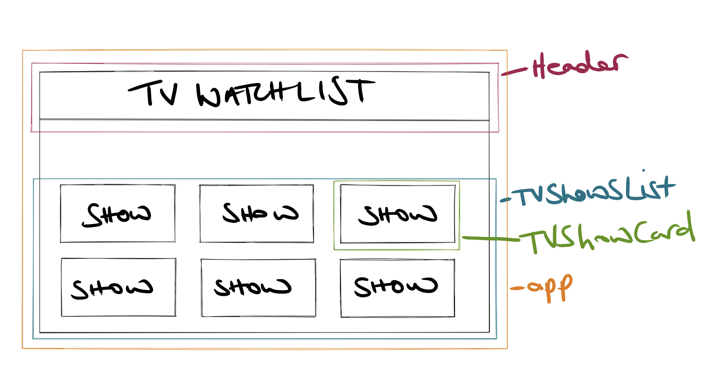
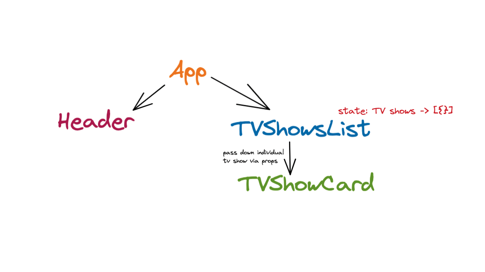

# Planning React App

Learning Objectives

You should keep refering to the relevant sections in the [Thinking in React docs](https://beta.reactjs.org/learn/thinking-in-react) which put an emphasise on the importance of planning our apps.

 

## Wireframe

Build up a very simple wireframe and component tree for displaying a list of TV Shows.

Talk about the premise of the app, how we want it to display a list of TV shows. You may allude to the fact that we will be looking at the functionality of adding a TV show in the following controlled components lecture.

Get students to help and have discussion around how to break up the whole app into components. Colour coded wireframes can help students visualise the different components and guide with their approach to styling in the future.

 

 

Use the wireframe to help plan a component tree. Again get students to help decipher the parent/child relationships seen within the wireframe.

Discuss where to place state. The example below places it in TVShowsList. Talk about the pros and cons affecting our decision around where to place state regardless of where we put it.

 

 

---
